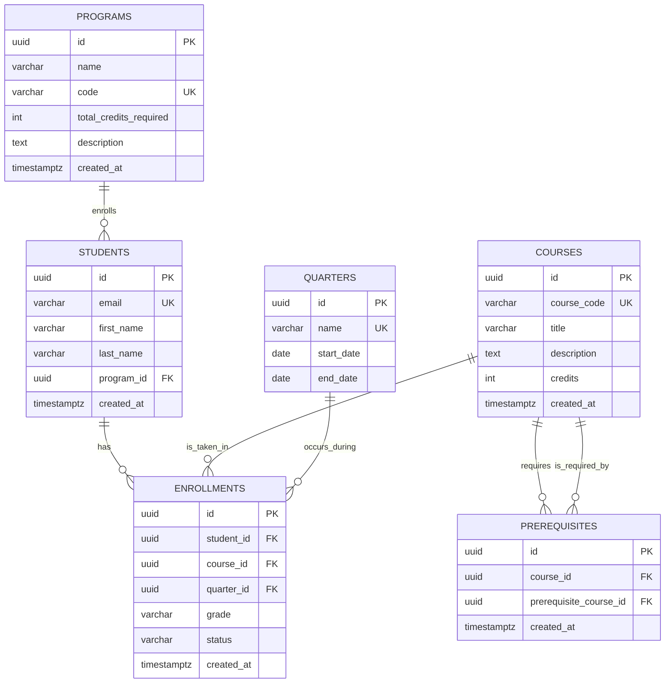

# NSC CourseMate — Entity Relationship Diagram

This diagram shows the core entities of the NSC CourseMate database and their relationships.

## ER Diagram

## Relationships Explained

- **Programs to Students:** A program can have many students; each student belongs to one program (or none).
- **Students to Enrollments:** A student can have many enrollments across different quarters.
- **Courses to Enrollments:** A course can be taken by many students across different quarters.
- **Quarters to Enrollments:** Each enrollment occurs in exactly one quarter.
- **Courses to Prerequisites:** A course can have many prerequisites; a single course can also be a prerequisite for many other courses (self-referential many-to-many through the prerequisites junction table).

## Key Design Decisions

- **UUIDs as primary keys** for all tables to ensure global uniqueness and enable safe horizontal scaling.
- **Self-referential prerequisites** modeled through a junction table to support recursive CTE queries for traversing prerequisite chains.
- **`student_progress` view** abstracts the credit calculation logic away from the application layer, ensuring consistency across all clients.
- **CHECK constraints** validate domain rules at the database layer (e.g., grade values, credits > 0, valid quarter dates).
- **Indexes** added on frequently queried columns: `email`, `course_code`, foreign keys in junction tables.

## Future Schema Additions

- `course_offerings` table to model which courses are offered in which quarters with section, instructor, and capacity data.
- `degree_requirements` table to formalize what courses each program needs.
- `student_plans` and `plan_courses` to support the planner feature for future quarters.
